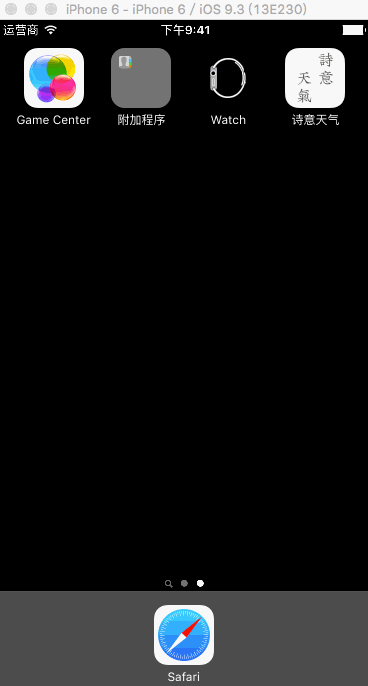

# TWeather

自学用Swift开发的一款简单的天气APP，超级简单。现已上架APPStore，[点我下载](https://itunes.apple.com/cn/app/shi-yi-tian-qi/id1137566372?mt=8)。

### 特点
- 采用龙爪繁体来展示天气预报信息
- 中间会根据当前的天气生成相应的古诗词，很有诗意
- 首页展示当日的天气，翻页显示后面三天的天气信息
- 采用了动画效果

### 不足
- 自学Swift做的一个小项目
- 界面和实现都很简单，需要进一步的学习

### 下载

